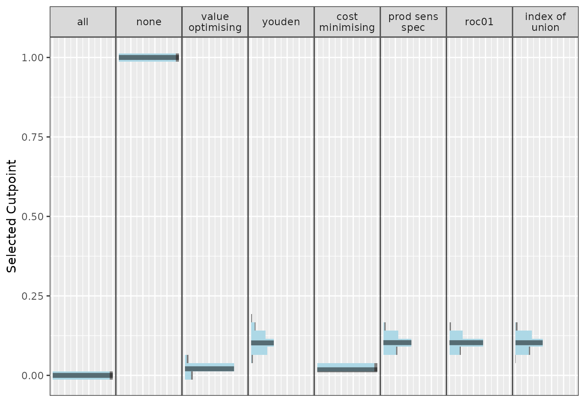
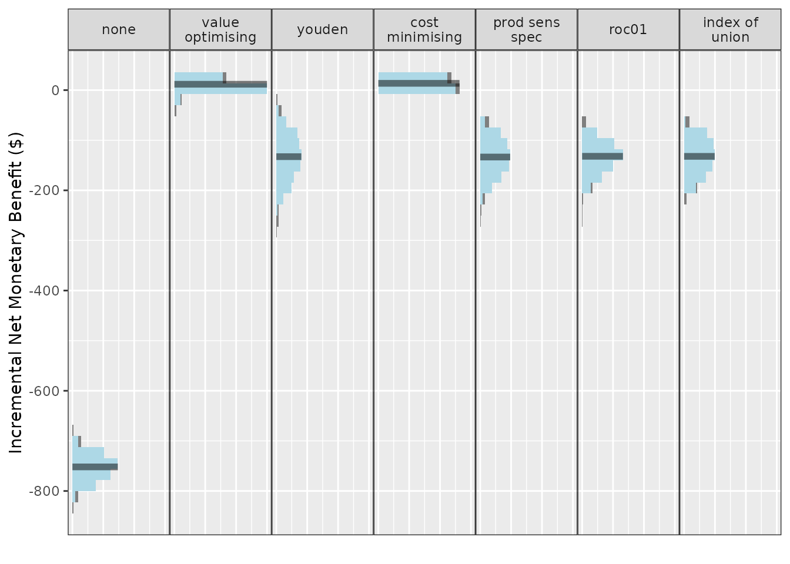
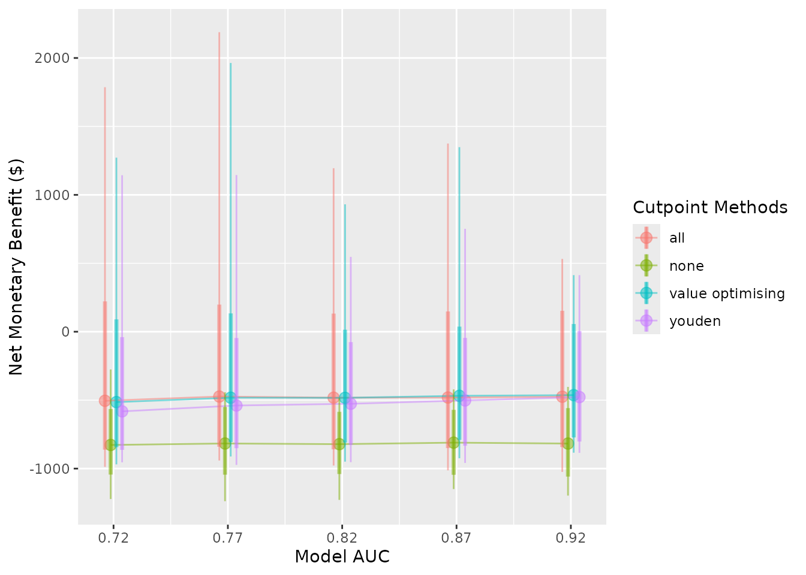
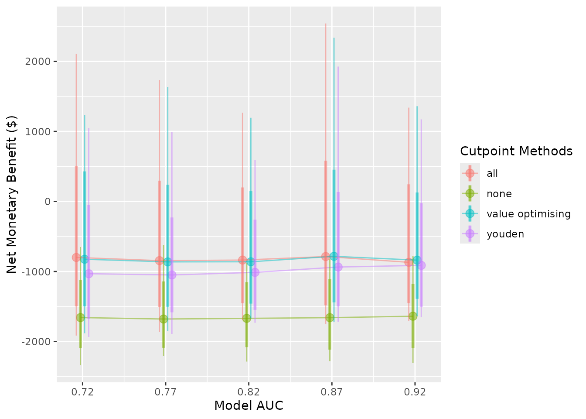
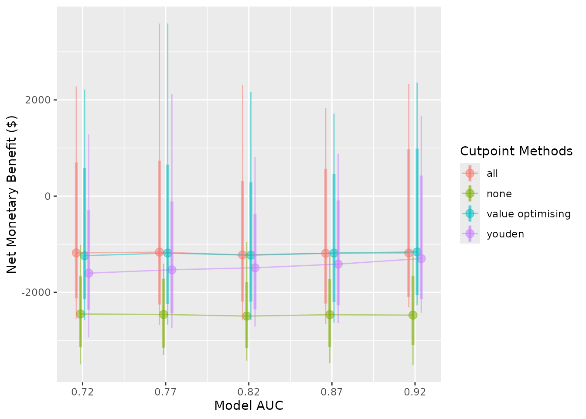
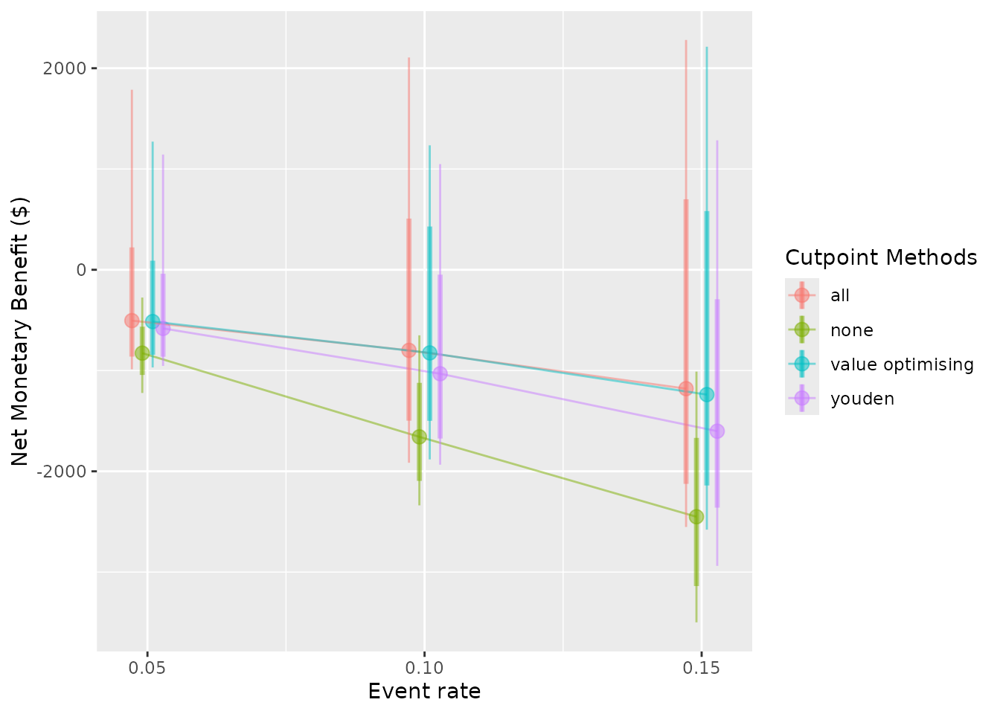

# Detailed example: pressure injury model

## Detailed example

Economic analyses often combine information from a variety of sources,
including randomised controlled trials, costing studies, and local data.
An advantage of simulation is that it can estimate the utility of a
proposed intervention prior to implementation.

In this example, we simulate the decision process for an analyst at a
hospital with a high rate of pressure injuries (or bedsores), also known
as pressure ulcers. Pressure ulcers are considered significant adverse
events for patients, often leading to additional discomfort, prolonged
length of hospital stay, and increased costs. The hospital currently
uses pressure ulcer prevention interventions routinely, but our analyst
is examining whether to implement a new clinical prediction model to
identify patients who may not benefit from existing interventions and
provide decision support to reduce non-beneficial care.

Let’s begin by generating some realistic costs, health utilities, and
probabilities. Keep in mind, we are trying to avoid a negative event, so
the net monetary benefit of every strategy in this scenario is going to
be negative. In this case, negative values will represent costs, we aim
to maximise these values (reduce costs). We are also interested in
improving patient quality of life, so we will incorporate
quality-adjusted life years (QALYs). To turn this into a net monetary
benefit calculation, we multiply our QALY change by a willingness-to-pay
threshold (WTP), and add this gain or loss to our true positive and
false negative estimates to signify the impact on the patient. We can
begin building our model using values from the literature.

Model inputs:

- Mean incremental cost per pressure injury: \$9,324 (SE 814), adapted
  from a study of Australian public hospitals and updated to 2021 AUD
  ([Nguyen et al. 2015](#ref-nguyen2015pressure))
- Per-patient cost of pressure ulcer prevention intervention (PUP):
  \$161 (SE 49), taken from a 2017 study and updated to 2021 AUD
  ([Whitty et al. 2017](#ref-WHITTY201735))
- Health utility decrement of a pressure ulcer: 0.23 ([Padula et al.
  2019](#ref-Padula2019-ub)) with distribution inputs derived using
  ([White and Blythe 2023](#ref-white_blythe_2023))
- The hazard ratio of pressure ulcers with the intervention compared to
  non-intervention: 0.58 (log hazard ratio SE 0.43) ([Chaboyer et al.
  2016](#ref-chaboyer2016effect))
- AUC: 0.82 ([Cichosz et al. 2019](#ref-cichosz2019prediction))
- Hypothetical hospital pressure injury incidence/event rate: 0.1 (SE
  0.02)

With these inputs, we can populate our confusion matrix (2 \times 2
table), which helps us understand the outcomes resulting from correct
and incorrect predictions.

### Model inputs

``` r

library(predictNMB)
library(parallel)
```

First, we need to create our NMB sampler function using
[`get_nmb_sampler()`](https://docs.ropensci.org/predictNMB/reference/get_nmb_sampler.md),
which provides data for our simulation. In this case, the intervention
is associated with a hazard ratio of 0.58 for pressure ulcers under
intervention conditions compared to standard care. We can use a
probability-weighted cost saving for successful prevention, at
\$9324\*(0.58) = an improvement of around \$5048. After including \$161
in intervention costs, the net benefit is around \$4888 for a
successfully prevented pressure ulcer. We also want to know how this
impacts the patient, so we include a utility loss (lost QALYs) of 0.23
as a result of getting a pressure ulcer.

The AUC for our hypothetical model is 0.82, which represents the
proportion of random positive patients that received a higher
probability of an injury than random negative patients (and vice versa).
A useful property of the AUC is that it is the same no matter what
probability threshold we use. In our case, an AUC of 0.82 means that the
model will assign higher probabilities of a pressure ulcer to around 82%
of patients who go on to develop an ulcer compared to patients that
don’t.

``` r

fx_nmb <- get_nmb_sampler(
  outcome_cost = 9324,
  wtp = 28033,
  qalys_lost = 0.23,
  high_risk_group_treatment_effect = 0.58,
  high_risk_group_treatment_cost = 161
)


fx_nmb()
#>                               TP                               FP 
#>                        -6785.068                         -161.000 
#>                               TN                               FN 
#>                            0.000                       -15771.590 
#>                       qalys_lost                              wtp 
#>                            0.230                        28033.000 
#>                     outcome_cost high_risk_group_treatment_effect 
#>                         9324.000                            0.580 
#>   high_risk_group_treatment_cost  low_risk_group_treatment_effect 
#>                          161.000                            0.000 
#>    low_risk_group_treatment_cost 
#>                            0.000
```

For a first pass, we want to see how our current values affect the
estimated outcomes of model implementation. We will just use our best
guesses for now, but for a more rigorous simulation, we will want to use
Monte Carlo methods to sample from input distributions.

``` r

nmb_simulation <- do_nmb_sim(
  # Evaluating a theoretical cohort of 1,000 patients
  sample_size = 1000, 
  
  # The larger the number of simulations, the longer it takes to run, but the 
  # more reliable the results
  n_sims = 500, 
  
  # Number of times the NMB is evaluated under each cutpoint
  n_valid = 10000, 
  
  # The AUC of our proposed model
  sim_auc = 0.82,
  
  # The incidence of pressure ulcers at our hypothetical hospital
  event_rate = 0.1, 
  
  # As a first pass, we will just use our confusion matrix vector above for 
  # training and evaluation
  fx_nmb_training = fx_nmb, 
  fx_nmb_evaluation = fx_nmb
)
```

``` r

nmb_simulation
#> predictNMB object
#> 
#> Training data sample size:  1000
#> Minimum number of events in training sample:  100
#> Evaluation data sample size:  10000
#> Number of simulations:  500
#> Simulated AUC:  0.82
#> Simulated event rate:  0.1

# Get the median incremental NMB for each threshold selection method
summary(nmb_simulation) 
#> # A tibble: 8 × 3
#>   method           median `95% CI`          
#>   <chr>             <dbl> <chr>             
#> 1 all               -822. -861.2 to -788.3  
#> 2 cost minimising   -808. -849.1 to -772.2  
#> 3 index of union    -955. -1045 to -882.9   
#> 4 none             -1574  -1667.1 to -1493.6
#> 5 prod sens spec    -955. -1058.3 to -874.2 
#> 6 roc01             -957. -1038.7 to -890.9 
#> 7 value optimising  -812. -862.7 to -773.5  
#> 8 youden            -954. -1069.1 to -859

# Demonstrates the range of selected cutpoints under each method
autoplot(nmb_simulation, what = "cutpoints") + theme_sim()
```



``` r

# Compares the incremental benefit of each alternate strategy to our 
# current practice (treat all)
autoplot(nmb_simulation, what = "inb", inb_ref_col = "all") + theme_sim()
```



Our first pass shows treating none is likely to be an undesirable
option, outperformed by every other method. If we set treat none as the
reference strategy, it would have associated costs and QALYs of 0. Treat
all looks like a pretty good choice, so we could consider making the
intervention standard practice. The best option from an NMB perspective
looks to be our value optimising or the cost minimising method. The
first plot shows that this is actually a lower threshold than the Youden
index and other equivalents, which means that we can be a bit less
strict in deciding who gets the intervention. So our intervention might
be worth using even for some lower-risk patients.

Results from the ROC-based methods like the Youden index and index of
union are also quite uncertain, so we may not want to use them for these
input parameters. However, the utility of these models and the threshold
selection methods based on the ROC might improve as they get more
accurate, or as the event rate increases; what we really want to know is
how robust our results are to changes in the input parameters. This is
the purpose of
[`screen_simulation_inputs()`](https://docs.ropensci.org/predictNMB/reference/screen_simulation_inputs.md).
We can not only simulate from a distribution for our cost inputs, but we
can also pass a vector to the AUC and incidence arguments to understand
how these impact our findings.

First, let’s specify our sampler function for the confusion matrix. We
can replace our inputs with single samples from distributions that
represent our data. If you just use a regular distribution sample, for
example, with [`rnorm()`](https://rdrr.io/r/stats/Normal.html), it will
only evaluate this function once. To ensure we are resampling each
distribution for each simulation run, we need to begin with a
`function()` and then the sample value. This propagates the uncertainty
of these distributions into the NMB values in the many simulations that
we run.

``` r


fx_nmb_sampler <- get_nmb_sampler(
  outcome_cost = function() rnorm(n = 1, mean = 9324, sd = 814),
  wtp = 28033,
  qalys_lost = function() (rbeta(n = 1, shape1 = 25.41, shape2 = 4.52) - rbeta(n = 1, shape1 = 67.34, shape2 = 45.14)),
  high_risk_group_treatment_effect = function() exp(rnorm(n = 1, mean = log(0.58), sd = 0.43)),
  high_risk_group_treatment_cost = function() rnorm(n = 1, mean = 161, sd = 49)
)


fx_nmb_sampler()
#>                               TP                               FP 
#>                    -3.758125e+03                    -2.172722e+02 
#>                               TN                               FN 
#>                     0.000000e+00                    -1.461388e+04 
#>                       qalys_lost                              wtp 
#>                     2.293553e-01                     2.803300e+04 
#>                     outcome_cost high_risk_group_treatment_effect 
#>                     8.184365e+03                     7.577062e-01 
#>   high_risk_group_treatment_cost  low_risk_group_treatment_effect 
#>                     2.172722e+02                     0.000000e+00 
#>    low_risk_group_treatment_cost 
#>                     0.000000e+00
fx_nmb_sampler()
#>                               TP                               FP 
#>                    -7.432796e+03                    -1.338687e+02 
#>                               TN                               FN 
#>                     0.000000e+00                    -1.500634e+04 
#>                       qalys_lost                              wtp 
#>                     2.556022e-01                     2.803300e+04 
#>                     outcome_cost high_risk_group_treatment_effect 
#>                     7.841040e+03                     5.136103e-01 
#>   high_risk_group_treatment_cost  low_risk_group_treatment_effect 
#>                     1.338687e+02                     0.000000e+00 
#>    low_risk_group_treatment_cost 
#>                     0.000000e+00
fx_nmb_sampler()
#>                               TP                               FP 
#>                    -1.512845e+04                    -1.354214e+02 
#>                               TN                               FN 
#>                     0.000000e+00                    -2.026976e+04 
#>                       qalys_lost                              wtp 
#>                     3.721960e-01                     2.803300e+04 
#>                     outcome_cost high_risk_group_treatment_effect 
#>                     9.835991e+03                     2.603256e-01 
#>   high_risk_group_treatment_cost  low_risk_group_treatment_effect 
#>                     1.354214e+02                     0.000000e+00 
#>    low_risk_group_treatment_cost 
#>                     0.000000e+00
```

The sampler function shows that we can expect some significant
variation, especially due to the probability that our intervention is
effective. It’s always possible that an intervention could lead to worse
patient outcomes. In our case, some true positives could be worse than
false negatives!

We should also check whether changing the other inputs can lead to
different results. Perhaps the authors of the clinical prediction model
reported a misleading AUC and when we implement the model it turns out
to be lower, or perhaps our pressure ulcer rate in some wards is
actually quite different to the average incidence at the hospital. By
replacing our `sim_auc` and `event_rate` arguments with vectors, we can
run simulations for each possible combination we are interested in.

In the snippet below, we will compare the treat-all strategy to total
disinvestment from the intervention (“none”) and to a couple of
alternatives, model-guided strategies, using the “value_optimising” and
“youden” thresholds.

We can also do this in parallel to speed things up.

``` r

cl <- makeCluster(2)
sim_pup_screen <- screen_simulation_inputs(
  n_sims = 500,
  n_valid = 10000,
  sim_auc = seq(0.72, 0.92, 0.05),
  event_rate = c(0.05, 0.1, 0.15),
  cutpoint_methods = c("all", "none", "value_optimising", "youden"),
  fx_nmb_training = fx_nmb,
  fx_nmb_evaluation = fx_nmb_sampler,
  cl = cl
)
stopCluster(cl)
```

``` r

summary(sim_pup_screen)
#> # A tibble: 15 × 10
#>    sim_auc event_rate all_median `all_95% CI`     none_median `none_95% CI`     
#>      <dbl>      <dbl>      <dbl> <chr>                  <dbl> <chr>             
#>  1    0.72       0.05      -505. -861.2 to 222.4        -827. -1043.3 to -557.5 
#>  2    0.72       0.1       -800. -1495.3 to 524.8      -1658. -2091.9 to -1118.5
#>  3    0.72       0.15     -1180. -2121 to 706.4        -2451. -3121 to -1666    
#>  4    0.77       0.05      -474. -839.9 to 199.1        -817. -1043.5 to -548.7 
#>  5    0.77       0.1       -845. -1505.3 to 302.7      -1679. -2079.5 to -1128.9
#>  6    0.77       0.15     -1165. -2250.4 to 748.4      -2461. -3124.7 to -1708.5
#>  7    0.82       0.05      -482. -858.2 to 136.2        -822. -1039.4 to -582.6 
#>  8    0.82       0.1       -837. -1453.4 to 212.3      -1669. -2075.1 to -1140.5
#>  9    0.82       0.15     -1223. -2188.4 to 313.5      -2494. -3159.1 to -1787.5
#> 10    0.87       0.05      -481. -847.7 to 152.2        -810. -1042.9 to -567.9 
#> 11    0.87       0.1       -786. -1479.9 to 610.9      -1659. -2113.6 to -1098.9
#> 12    0.87       0.15     -1188  -2233.3 to 569.5      -2465. -3126.5 to -1724.1
#> 13    0.92       0.05      -475  -842.7 to 153.9        -817. -1057.4 to -554.1 
#> 14    0.92       0.1       -869. -1450.6 to 253.7      -1639. -2088.7 to -1159.6
#> 15    0.92       0.15     -1182. -2097.6 to 993.2      -2475. -3085.3 to -1654.6
#> # ℹ 4 more variables: `value optimising_median` <dbl>,
#> #   `value optimising_95% CI` <chr>, youden_median <dbl>, `youden_95% CI` <chr>
```

As our model accuracy increases and event rate decreases, treatment
decisions based on the model, like the Youden index, begin to look
better. There are reasonable gains from using the prediction model, even
though there is some uncertainty. If the event rates 0.05, 0.10 and 0.15
corresponded to different wards of the hospital, our simulation could
represent the estimated effectiveness of different strategies in each
setting.

We can also represent these results visually.

``` r

autoplot(
  sim_pup_screen, 
  x_axis_var = "sim_auc",
  constants = c(event_rate = 0.05), 
  dodge_width = 0.01
)
#> 
#> 
#> Varying simulation inputs, other than sim_auc, are being held constant:
#> event_rate: 0.05
```



``` r


autoplot(
  sim_pup_screen, 
  x_axis_var = "sim_auc",
  constants = c(event_rate = 0.10),
  dodge_width = 0.01
)
#> 
#> 
#> Varying simulation inputs, other than sim_auc, are being held constant:
#> event_rate: 0.1
```



``` r


autoplot(
  sim_pup_screen, 
  x_axis_var = "sim_auc",
  constants = c(event_rate = 0.15),
  dodge_width = 0.01
)
#> 
#> 
#> Varying simulation inputs, other than sim_auc, are being held constant:
#> event_rate: 0.15
```



``` r


autoplot(
  sim_pup_screen, 
  x_axis_var = "event_rate", 
  dodge_width = 0.0075
)
#> 
#> 
#> Varying simulation inputs, other than event_rate, are being held constant:
#> sim_auc: 0.72
```



The nice thing about our value-optimising function is that it tends to
follow the best threshold, regardless of AUC or event rate. In this
case, it tends to dynamically follow the best treatment decision as it
moves across, which is why the value optimising strategy tends to
overlap with the best alternative in the plots. We can also see that the
Youden index begins to look better at higher accuracy and higher
incidence rates, but predicting what patients will get a pressure ulcer
is challenging.

Ultimately at our given AUC and event rate, the prediction model might
be worth using. In the original study, Whitty and colleagues found that
the prevention program was not cost-effective; however, by combining it
with a prediction model, it could be worth implementing, especially in
wards where the event might be rarer. ([Whitty et al.
2017](#ref-WHITTY201735)).

## References

Chaboyer, Wendy, Tracey Bucknall, Joan Webster, et al. 2016. “The Effect
of a Patient Centred Care Bundle Intervention on Pressure Ulcer
Incidence (INTACT): A Cluster Randomised Trial.” *International Journal
of Nursing Studies* 64: 63–71.

Cichosz, Simon Lebech, Anne-Birgitte Voelsang, Lise Tarnow, John Michael
Hasenkam, and Jesper Fleischer. 2019. “Prediction of in-Hospital
Pressure Ulcer Development.” *Advances in Wound Care* 8 (1): 1–6.

Nguyen, Kim-Huong, Wendy Chaboyer, and Jennifer A Whitty. 2015.
“Pressure Injury in Australian Public Hospitals: A Cost-of-Illness
Study.” *Australian Health Review* 39 (3): 329–36.

Padula, William V, Peter J Pronovost, Mary Beth F Makic, et al. 2019.
“Value of Hospital Resources for Effective Pressure Injury Prevention: A
Cost-Effectiveness Analysis.” *BMJ Quality & Safety* 28 (2): 132–41.

White, Nicole, and Robin Blythe. 2023. *ShinyPrior: A Tool for
Estimating Probability Distributions Using Published Evidence*. OSF
Preprints. <https://doi.org/10.31219/osf.io/zf62e>.

Whitty, Jennifer A., Elizabeth McInnes, Tracey Bucknall, et al. 2017.
“The Cost-Effectiveness of a Patient Centred Pressure Ulcer Prevention
Care Bundle: Findings from the INTACT Cluster Randomised Trial.”
*International Journal of Nursing Studies* 75: 35–42.
https://doi.org/<https://doi.org/10.1016/j.ijnurstu.2017.06.014>.
