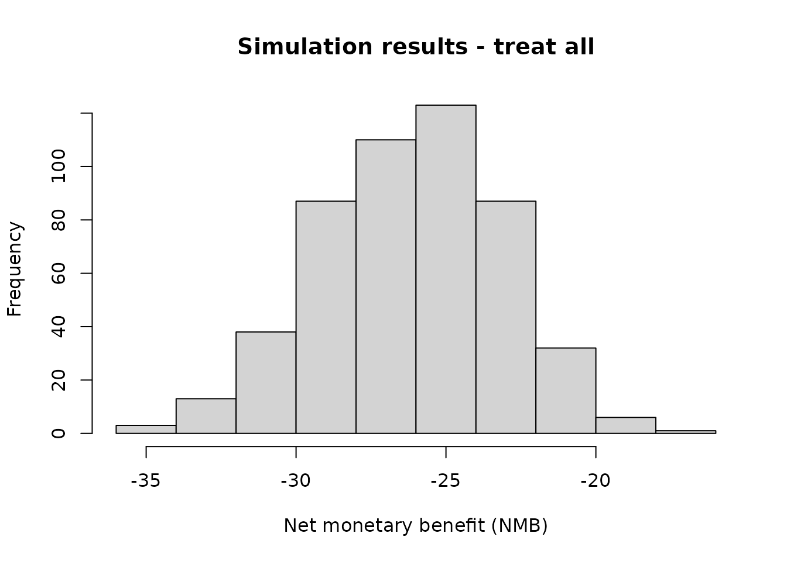
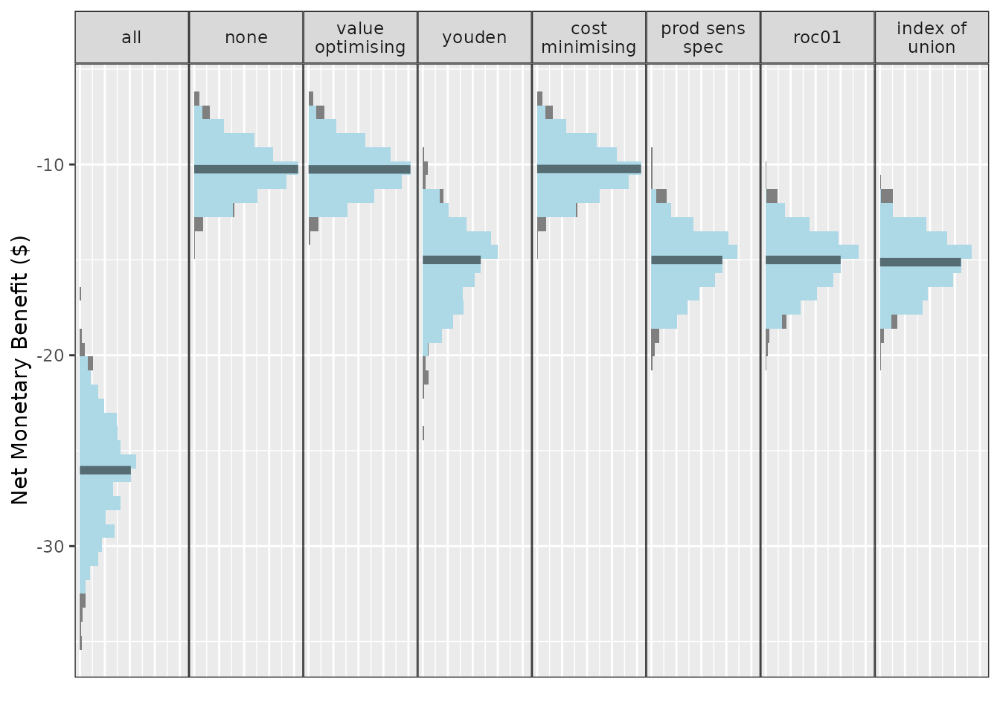
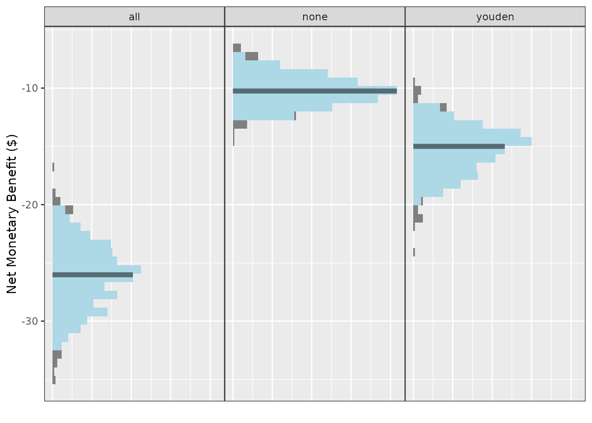
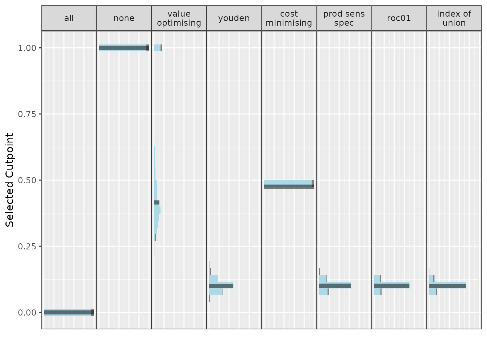
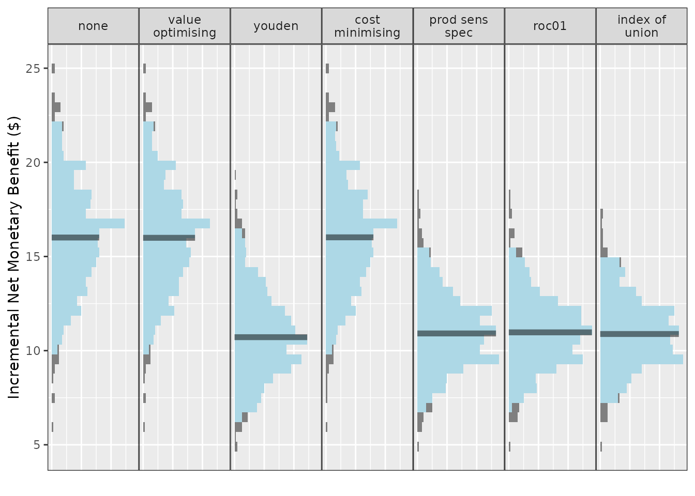
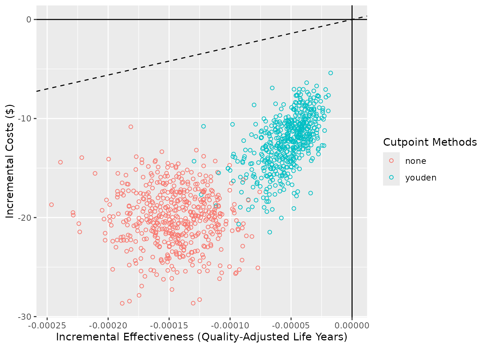

# predictNMB

## Introduction

[predictNMB](https://docs.ropensci.org/predictNMB/) can be used to
evaluate existing or hypothetical clinical prediction models based on
their Net Monetary Benefit (NMB). This can be relevant to both
prognostic and diagnostic models where a cutpoint (AKA, probability
threshold) is used to generate predicted classes rather than
probabilities. While it is often beneficial in clinical settings to
present the user with a predicted probability, it may be helpful to
simulate the effect of the decision arising from this probability. For
example, in a hospital setting, a user might want to specify the
probability threshold for a clinical prediction model that predicts
inpatient falls at which best practice suggests providing a
fall-prevention intervention over non-treatment as the default strategy.
By weighing the NMB of these decisions, users can assess the impact of
the model and the suggested threshold prior to implementation.

[predictNMB](https://docs.ropensci.org/predictNMB/) was born out of
related work ([Parsons et al. 2023](#ref-parsons2023integrating)) that
investigates cutpoint selection methods that maximise the NMB and
includes several options for inbuilt and user-specified cutpoint
selection functions.

``` r

library(predictNMB)
library(parallel)
set.seed(42)
```

### What’s being simulated?

When
[`do_nmb_sim()`](https://docs.ropensci.org/predictNMB/reference/do_nmb_sim.md)
is run, many datasets are created, and models are fit and evaluated
based on their NMB. To evaluate NMB, the user is required to specify
functions that define each square of the confusion matrix, which arises
from binary classification:

- TP: True Positives, correctly predicted events that lead to necessary
  treatment
- TN: True Negatives, correctly predicted non-events that avoid
  unnecessary treatment
- FP: False Positives, incorrectly predicted positives that lead to
  unnecessary treatment
- FN: False Negatives, incorrectly predicted non-events that lead to a
  lack of necessary treatment

These are presented as a function so that we can repeatedly sample from
it to get uncertainty estimates. We might want to sample from a
distribution for uncertain parameters (for example, TP and FN) or use
constants for parameters we are certain of (here, TN and FP). The
function returns a vector representing each square of the matrix when
called.

#### Example function

``` r

nmb_sampler <- get_nmb_sampler(
  wtp = 28033,
  qalys_lost = function() rnorm(n = 1, mean = 0.0036, sd = 0.0005),
  high_risk_group_treatment_cost = function() rnorm(n = 1, mean = 20, sd = 3),
  high_risk_group_treatment_effect = function() rbeta(n = 1, shape1 = 40, shape2 = 60)
)

rbind(nmb_sampler(), nmb_sampler(), nmb_sampler())
#>             TP        FP TN        FN  qalys_lost   wtp outcome_cost
#> [1,] -96.92150 -21.08939  0 -120.1348 0.004285479 28033            0
#> [2,] -83.06080 -19.68163  0 -109.7893 0.003916431 28033            0
#> [3,] -99.95635 -26.05527  0 -122.1050 0.004355761 28033            0
#>      high_risk_group_treatment_effect high_risk_group_treatment_cost
#> [1,]                        0.3687750                       21.08939
#> [2,]                        0.4227200                       19.68163
#> [3,]                        0.3947746                       26.05527
#>      low_risk_group_treatment_effect low_risk_group_treatment_cost
#> [1,]                               0                             0
#> [2,]                               0                             0
#> [3,]                               0                             0
```

Every time we run this function, we get a new named vector for the NMB
associated with each prediction. We can inform the distributions that we
sample from based on the literature for the specific clinical prediction
model at hand. See the [detailed example
vignette](https://docs.ropensci.org/predictNMB/articles/detailed-example.html)
for a more in-depth description of using estimates from the literature.

In this example function, the value returned for the True Negative (TN)
is zero. This may reflect a scenario where patients categorised as low
risk are not given any treatment and do not experience the event being
predicted (e.g. a fall) so do not have those associated costs either.
The False Negative (FN) is the most negative value; this is because this
reflects the worst possible outcome: the patient experiences the event
and no intervention was provided to reduce its rate or the effect of its
associated costs. The True Positive value is similar to the FN, but is
not as negative, because the patient received the intervention and this
reduced the associated costs, possibly by reducing the rate of the
event. These two classifications have uncertainty associated with them
since the costs associated with the outcome are uncertain. This is
unlike the False Positive (FP), which has a fixed cost of \$20. This may
be realistic when there are set costs for providing the intervention.
For example, if the intervention is to conduct a falls education session
with the patient, this may have an exact, known cost. See the detailed
example vignette for further description and an example of how to decide
on which values to use.

Since we would expect to use our best estimates, in this case, the
expected value of the NMB associated with each prediction for an actual
model (and not take a random sample from its underlying distributions),
we will make a separate function for the purpose of obtaining the
cutpoint, separately from the one we used (above) to evaluate it.

We can use the same code to create the function with
[`get_nmb_sampler()`](https://docs.ropensci.org/predictNMB/reference/get_nmb_sampler.md)
but use `use_expected_values = TRUE` so that it gives us the expected
values for each rather than resampling from the underlying distribution
each time it’s evaluated.

``` r

nmb_sampler_training <- get_nmb_sampler(
  wtp = 28033,
  qalys_lost = function() rnorm(n = 1, mean = 0.0036, sd = 0.0007),
  high_risk_group_treatment_cost = rnorm(n = 1, mean = 20, sd = 5),
  high_risk_group_treatment_effect = function() rbeta(n = 1, shape1 = 40, shape2 = 60),
  use_expected_values = TRUE
)
rbind(nmb_sampler_training(), nmb_sampler_training(), nmb_sampler_training())
#>             TP        FP TN        FN  qalys_lost   wtp outcome_cost
#> [1,] -91.98138 -31.43323  0 -100.8563 0.003597771 28033            0
#> [2,] -91.98138 -31.43323  0 -100.8563 0.003597771 28033            0
#> [3,] -91.98138 -31.43323  0 -100.8563 0.003597771 28033            0
#>      high_risk_group_treatment_effect high_risk_group_treatment_cost
#> [1,]                        0.3997178                       31.43323
#> [2,]                        0.3997178                       31.43323
#> [3,]                        0.3997178                       31.43323
#>      low_risk_group_treatment_effect low_risk_group_treatment_cost
#> [1,]                               0                             0
#> [2,]                               0                             0
#> [3,]                               0                             0
```

These inputs can be passed to
[`screen_simulation_inputs()`](https://docs.ropensci.org/predictNMB/reference/screen_simulation_inputs.md)
under the parameters `fx_nmb_training` and `fx_nmb_evaluation`, to be
evaluated in each simulation.

## `do_nmb_sim()`

[`do_nmb_sim()`](https://docs.ropensci.org/predictNMB/reference/do_nmb_sim.md)
does a single simulation with a set of inputs for the hypothetical model
and NMB-related functions. For the model, we need to know the sample
size for training and evaluation sets, the model’s discrimination (Area
Under the Receiver Operating Characteristic Curve, also known as the
Area Under the Curve, or AUC) and the event rate of the outcome being
predicted. To create this model, the specified AUC is transformed to a
Cohen’s D value ([Salgado 2018](#ref-SalgadoJes%C3%BAsF.2018Ttau)). A
single predictor variable for the negative events is sampled from a
standard normal distribution (mean = 0; standard deviation = 1) and the
positive events have theirs sampled from a normal distribution with a
mean equal to the calculated Cohen’s D value and standard deviation
of 1. These data are then used to fit a logistic regression model with a
single predictor and intercept term.

Note that it may take some time to run the simulation. (The one below
may take up to a minute, depending on your computer’s performance.)

We have used `show_progress = TRUE` so that this progress is displayed
but, by default, this progress bar is not shown.

``` r

nmb_simulation <- do_nmb_sim(
  sample_size = 1000,
  n_sims = 500,
  n_valid = 10000,
  sim_auc = 0.7,
  event_rate = 0.1,
  fx_nmb_training = nmb_sampler_training,
  fx_nmb_evaluation = nmb_sampler,
  show_progress = TRUE
)
```

``` r

nmb_simulation
#> predictNMB object
#> 
#> Training data sample size:  1000
#> Minimum number of events in training sample:  100
#> Evaluation data sample size:  10000
#> Number of simulations:  500
#> Simulated AUC:  0.7
#> Simulated event rate:  0.1
```

We can access simulation outputs like NMB and cutpoints directly from
our simulation object, and choose strategies to examine further using
this list. This is useful to examine histograms or get summary values.
For example, our current default strategy might be to treat all, which
is the same as setting our probability threshold for treatment to 0:

``` r

hist(
  nmb_simulation$df_result$all, 
  main = "Simulation results - treat all", 
  xlab = "Net monetary benefit (NMB)"
)
```



``` r


summary(nmb_simulation$df_result$all)
#>    Min. 1st Qu.  Median    Mean 3rd Qu.    Max. 
#>  -35.06  -28.18  -26.02  -26.16  -23.99  -16.90
```

The simulation under the various cutpoints can be visualised using
[`autoplot()`](https://ggplot2.tidyverse.org/reference/autoplot.html).
The default is to visualise the distributions of NMB across all (500)
simulations. In the plot below, the spread (light blue) shows the
variability in results due to repeated simulations. The median is
represented by the dark blue line in the center of each distribution.
Here, we use
[`theme_sim()`](https://docs.ropensci.org/predictNMB/reference/theme_sim.md)
to reduce clutter on these plots.

``` r

autoplot(nmb_simulation) + theme_sim()
```



Treating all looks like a bad option here. The rest are relatively
similar at this AUC and event rate, with an edge to treat none or the
models using either the value optimisation or cost minimisation cutpoint
method.

We have options to include multiple cutpoint methods, and the default is
to use all of the available inbuilt methods as well as the treat-all and
treat-none strategies. We can specify which methods are shown in the
plots when creating the plot. (For more details on plotting, see the
[summarising results
vignettes](https://docs.ropensci.org/predictNMB/articles/summarising-results-with-predictNMB.html).)

``` r

get_inbuilt_cutpoint_methods()
#> [1] "all"              "none"             "value_optimising" "youden"          
#> [5] "cost_minimising"  "prod_sens_spec"   "roc01"            "index_of_union"

autoplot(nmb_simulation, methods_order = c("all", "none", "youden")) + theme_sim()
```



We can also use this same plotting function to visualise cutpoints or
the incremental net monetary benefit (INB) if we have a known reference
strategy, in this case, treat-all:

``` r

autoplot(nmb_simulation, what = "cutpoints") + theme_sim()
```



``` r

autoplot(nmb_simulation, what = "inb", inb_ref_col = "all") + theme_sim()
```



Compared with treat-all, every alternative looks better, but treating
none or using value-optimising/cost-minimising looks the best.

We can compare the NMB for each cutpoint method, as before, by accessing
the object directly:

``` r

head(nmb_simulation$df_result)
#>   n_sim       all       none value_optimising    youden cost_minimising
#> 1     1 -22.22199  -8.186313        -8.208747 -12.99218       -8.201596
#> 2     2 -27.02869  -8.614284        -8.613603 -13.48818       -8.630615
#> 3     3 -26.38041 -10.109025       -10.106997 -13.61983      -10.114800
#> 4     4 -25.67286 -10.411186       -10.447631 -13.64471      -10.410777
#> 5     5 -26.38019 -12.860529       -12.866956 -15.27964      -12.866524
#> 6     6 -25.37463  -9.907368        -9.886667 -13.08035       -9.904925
#>   prod_sens_spec     roc01 index_of_union
#> 1      -12.99218 -12.99218      -12.99218
#> 2      -15.04459 -15.04459      -15.04459
#> 3      -14.07576 -14.07576      -14.07576
#> 4      -14.70168 -14.70168      -14.90180
#> 5      -15.27964 -15.27964      -17.83948
#> 6      -13.94385 -13.94385      -13.94385
```

… and do the same for our selected cutpoints:

``` r

head(nmb_simulation$df_thresholds)
#>   n_sim all none value_optimising     youden cost_minimising prod_sens_spec
#> 1     1   0    1        0.4224814 0.08633283       0.4752184     0.08633283
#> 2     2   0    1        0.5731429 0.13147073       0.4752184     0.11166643
#> 3     3   0    1        0.6834233 0.13119297       0.4752184     0.12219263
#> 4     4   0    1        0.2888253 0.12131014       0.4752184     0.10847953
#> 5     5   0    1        0.4387597 0.13239494       0.4752184     0.13239494
#> 6     6   0    1        0.2824096 0.10598321       0.4752184     0.09600777
#>        roc01 index_of_union
#> 1 0.08633283     0.08633283
#> 2 0.11166643     0.11166643
#> 3 0.12219263     0.12218998
#> 4 0.10847953     0.10636855
#> 5 0.13239494     0.09699308
#> 6 0.09600777     0.09600777
```

Since we incorporated QALYs and a WTP into out NMB sampling functions,
we can also create a cost-effectiveness plot with
[`ce_plot()`](https://docs.ropensci.org/predictNMB/reference/ce_plot.md).
For more details on
[`ce_plot()`](https://docs.ropensci.org/predictNMB/reference/ce_plot.md),
see the - [Summarising results from
`predictNMB vignette`](https://docs.ropensci.org/predictNMB/articles/summarising-results-with-predictNMB.html).

``` r

ce_plot(nmb_simulation, ref_col = "all", methods_order = c("all", "none", "youden"))
#> Ignoring unknown labels:
#> • shape : "list(`NA` = NULL)"
```



## `screen_simulation_inputs()`

We may want to investigate what the relative improvement in NMB is when
increasing the model performance (AUC) and compare this to the treat-all
or treat-none strategy. The following function assesses the required
performance for the model to outperform a default strategy of treat all
or treat none. In this example, cutpoints are selected using the Youden
index and the cost-effectiveness approach, which maximises NMB.

To do this, we compare multiple simulations with different inputs using
[`screen_simulation_inputs()`](https://docs.ropensci.org/predictNMB/reference/screen_simulation_inputs.md).
This function takes the same inputs as
[`do_nmb_sim()`](https://docs.ropensci.org/predictNMB/reference/do_nmb_sim.md)
but can take a vector of inputs rather than only a single value. Here,
we pass vectors for both the `sim_auc` and the `event_rate`.

We run the simulations in parallel by creating a cluster and passing
this as an argument. This can also be done to
[`do_nmb_sim()`](https://docs.ropensci.org/predictNMB/reference/do_nmb_sim.md)
in the same way. This can take some time — the fewer cores used, the
longer it takes. For more details on running in parallel, see the
`parallel` package.

``` r

cl <- makeCluster(2)
sim_screen_obj <- screen_simulation_inputs(
  n_sims = 500,
  n_valid = 10000,
  sim_auc = seq(0.7, 0.95, 0.05),
  event_rate = c(0.1, 0.2),
  fx_nmb_training = nmb_sampler_training,
  fx_nmb_evaluation = nmb_sampler,
  cutpoint_methods = c("all", "none", "youden", "value_optimising"),
  cl = cl
)
stopCluster(cl)
```

For our hypothetical costed outcome, the classification model when the
cutpoint is selected by maximising the Youden index, only outperforms
the treat-none strategy when the model has an AUC of about 0.9. This is
quite high and may be impossible when the outcome is highly
unpredictable. Also, when the event rate is 0.1, rather than 0.2, we are
only able the match the treat-none strategy when our model has an AUC of
0.95.

``` r

autoplot(sim_screen_obj, x_axis_var = "sim_auc", constants = c(event_rate = 0.2))
#> 
#> 
#> Varying simulation inputs, other than sim_auc, are being held constant:
#> event_rate: 0.2
```


``` r

autoplot(sim_screen_obj, x_axis_var = "sim_auc", constants = c(event_rate = 0.1))
#> 
#> 
#> Varying simulation inputs, other than sim_auc, are being held constant:
#> event_rate: 0.1
```


## References

Parsons, Rex, Robin Blythe, Susanna M Cramb, and Steven M McPhail. 2023.
“Integrating Economic Considerations into Cutpoint Selection May Help
Align Clinical Decision Support Toward Value-Based Healthcare.” *Journal
of the American Medical Informatics Association* 30 (6): 1103–13.

Salgado, Jesús F. 2018. “Transforming the Area Under the Normal Curve
(AUC) into Cohen’s d, Pearson’s Rpb, Odds-Ratio, and Natural Log
Odds-Ratio: Two Conversion Tables.” *The European Journal of Psychology
Applied to Legal Context* (Madrid) 10 (1): 35–47.
